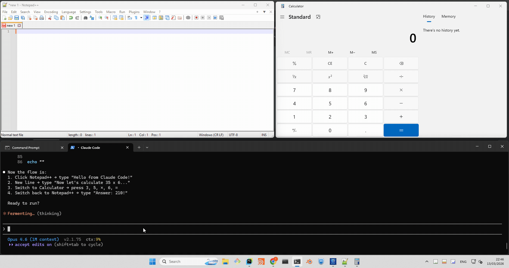

# windows-uia-cli

A **Claude Code plugin** that provides Windows UI automation capabilities. It wraps the Windows UI Automation (UIA) framework behind a simple JSON CLI, powered by a persistent PowerShell background server with zero dependencies.



## What's Included

- **Skill** (`skills/windows-ui-automation/`) — auto-discovered by Claude Code agents, teaches them how to use the CLI
- **CLI** (`skills/windows-ui-automation/scripts/uia_cli.ps1`) — thin client that sends JSON commands to the server
- **Server** (`skills/windows-ui-automation/scripts/uia_server.ps1`) — persistent background process with .NET UIA assemblies loaded; communicates via named pipe (`\\.\pipe\uia-server`)

## Prerequisites

- Windows 10 or Windows 11
- PowerShell 5.1+ (included with Windows)

## Installation

### Option 1: Dev mode (session only)

Load the plugin for the current session:

```bash
claude --plugin-dir <path-to-this-repo>
```

### Option 2: Persistent (via local marketplace)

This repo includes a `marketplace.json`, so it can be registered as a local marketplace. Add to your `~/.claude/settings.json`:

```json
{
  "extraKnownMarketplaces": {
    "3dfoundrylabs": {
      "source": {
        "source": "directory",
        "path": "<absolute-path-to-this-repo>"
      }
    }
  },
  "enabledPlugins": {
    "windows-uia-cli@3dfoundrylabs": true
  }
}
```

### Option 3: Persistent (via GitHub)

Register the GitHub repo as a marketplace source:

```json
{
  "extraKnownMarketplaces": {
    "3dfoundrylabs": {
      "source": {
        "source": "url",
        "url": "https://github.com/3dfoundrylabs/windows-uia-cli.git"
      }
    }
  },
  "enabledPlugins": {
    "windows-uia-cli@3dfoundrylabs": true
  }
}
```

Or interactively:

```
/plugin marketplace add https://github.com/3dfoundrylabs/windows-uia-cli.git
/plugin install windows-uia-cli@3dfoundrylabs
```

After installation, the skill appears as `windows-uia-cli:windows-ui-automation` and is auto-discovered by agents.

## Quick Start

```powershell
# Health check (starts server automatically)
powershell -NoProfile -ExecutionPolicy Bypass -File .\skills\windows-ui-automation\scripts\uia_cli.ps1 '{"cmd":"ping"}'

# List all open windows
powershell -NoProfile -ExecutionPolicy Bypass -File .\skills\windows-ui-automation\scripts\uia_cli.ps1 '{"cmd":"list_windows"}'

# Find all buttons in Notepad
powershell -NoProfile -ExecutionPolicy Bypass -File .\skills\windows-ui-automation\scripts\uia_cli.ps1 '{"cmd":"find_elements","args":{"window":"Untitled - Notepad","type":"Button"}}'
```

## Commands

| Command | Description |
|---------|-------------|
| `ping` | Health check, returns `pong` |
| `list_windows` | List all top-level windows |
| `find_window` | Find a window by exact title |
| `tree_walk` | Walk UI element tree (supports `type_filter`, `max_depth`) |
| `find_elements` | Search elements by `type`, `name`, `name_contains`, `auto_id`, `auto_id_contains`, `class_name` |
| `click_element` | Find and click an element in one call (uses fast UIA FindFirst) |
| `click` | Click at screen coordinates (supports `double`) |
| `type` | Send keystrokes (SendKeys syntax) |
| `set_value` | Set slider/input values via UIA patterns |
| `toggle` | Toggle checkboxes/toggle buttons via TogglePattern |
| `screenshot` | Capture full screen or a specific window to PNG |
| `quit` | Shut down the server |

See [skills/windows-ui-automation/references/commands.md](skills/windows-ui-automation/references/commands.md) for the full protocol reference with request/response examples.

## Architecture

On the first CLI call, `uia_cli.ps1` spawns `uia_server.ps1` as a hidden background process. The server loads .NET `UIAutomationClient` and `UIAutomationTypes` assemblies once, then listens on a named pipe. Each CLI invocation connects to the pipe, sends a JSON command, reads the JSON response, and disconnects. The server stays resident so assembly loading cost (~1s) is paid only once — server-side execution for most operations completes in 2–30ms. Total round-trip per CLI call is ~600ms, dominated by PowerShell process startup overhead. This can be further improved with command batching. A PID file in `%TEMP%` tracks the server process for auto-restart if it dies.

## License

[MIT](LICENSE)
